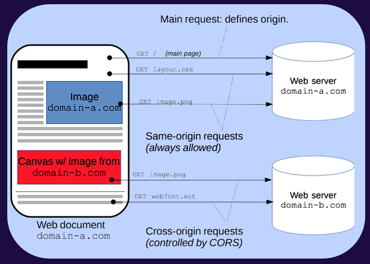

# handler:

Em Next.js, um "handler" ou "NextApiHandler" é uma função responsável por lidar com uma rota de API (Application Programming Interface). 
Em outras palavras, é uma função que define o comportamento da sua API em uma aplicação Next.js.

# mongoose: 
é o módulo do Node.js que permite interagir com bancos de dados MongoDB de forma assíncrona.

# connections: é uma propriedade de mongoose que contém um array de todas as conexões abertas atualmente.

## [0]: acessa o primeiro elemento do array de conexões. Em aplicações simples, pode haver apenas uma conexão e, portanto, estamos acessando a primeira (índice 0).
# readyState: é uma propriedade que indica o estado atual da conexão. Ela pode ter os seguintes valores:
0: desconectado
1: conectando
2: conectado
3: desconectando


Portanto, **mongoose.connections[0].readyState** retorna o estado atual da primeira conexão do Mongoose com o MongoDB. 
Isso pode ser útil para verificar se a conexão está estabelecida antes de executar determinadas operações no banco de dados. 
Por exemplo, você pode querer esperar até que a conexão esteja totalmente estabelecida antes de iniciar o servidor da sua aplicação.


# mongoose.connection.on: 
Isso registra um ouvinte de eventos na conexão do Mongoose.

# 'connected': 
Este é o evento que estamos ouvindo. Ele é disparado quando a conexão com o banco de dados é estabelecida com sucesso.

# Cadastrando um usuário;

Antes de qualquer coisa é interessante eu saber oque o meu user vai necessitar para ser cadastrado dentro do banco de daodos.
No caso, vamos necessitar de nome, email e password.
Vamos então criar esse itens na pasta types:

```ts
export type CadastroRequisicao = {
    nome: string,
    email: string,
    password: string
}
```

## Arquivo dentro do API

Este arquivo tem pouca diferença do meu login, ele vai verificar a minha entrada de dados, vai conectar no meu Schema e passar pelo middleware.

## Schema

o meu Schema vai ser responsavel por cirar meu usuário dentro da meu banco de dados:

```ts
export const UserModel = (mongoose.models.users || mongoose.model('users', userSchema));
```
Se já existir o **users** ele vai utilizar, se não existe ele vai criar.

# md5

Ele cria uma criptografia por cima de meus dados
logo, ao inves de eu mandar o meu user eu mando o meu userCriptografado

# Validando email

se pode usar ainda um trecho de código para validar meu email, proibindo a criação de 2 user com o mesmo email:

```ts
const usersWithSameEmail = await UserModel.find({email: user.email})
        if(usersWithSameEmail && usersWithSameEmail.length > 0){
            return res.status(400).json({erro: "Usuário já existente"})
        }
```
Se ele encontrar dentro do meu banco um email, com o mesmo que está sendo passado(**user.email**), ele vai travar a minha requisição

# Passando o meu usuario correto para o Login

Vamos usar o find do mesmo jeito que foi usado acima.
Primeiro vamos procurar se tem um usuário no banco de dados:
```ts
const usersFounders = await UserModel.find({email: login, password: md5(password)})
```

depois criamos um if, para verificar se dentro dessa minha constante encontramos um user:
```ts
 if(usersFounders && usersFounders.length > 0){
            ...
        }
```

E por último retornamos a menssagem:
```ts
    const userFound = usersFounders[0];
    return res.status(200).json({msg: `Usuário..: ${userFound.nome} autenticado com sucesso`})
```

# validarToken

## Validar a chave e acesso
```ts
const {MINHA_CHAVE_JWT} = process.env;

    if(!MINHA_CHAVE_JWT){
        return res.status(500).json({erro: `ENV de chave JWT não informada na execução do processo`})
    }
```

## Validar se veio algum header

Pois, precisa ter pelo menos um header, que é o de autorização que vai passar o meu token Bearer

```ts
if(!res || !req.headers){
        return res.status(401).json({erro: `Não foi possível validar o token de acesso`})
    }
```

## Validou se veio o OPTION 

O navegador vai fazer um **OPTIONS** como padrão, antes mesmo de fazer o **POST**. 
E o **OPTIONS** não manda executar o serviço, só cola as informações do serviço, ele busca quais são os headers obrigatorios e precisa passar.
Logo, vale a pena quando for o **OPTIONS**, mandar ele seguir em frente, pois, talvez não tenha passado o header ainda.
So precisamos do header no **POST** mesmo

```ts
if(req.method !== "OPTIONS"){
    ...
}
```

## Validar se veio o header de autorização e o token

```ts
 const authorization = req.headers['authorization'];
        if(!authorization){
            return res.status(401).json({erro: `Não foi possível validar o token de acesso`})
        }
        const token = authorization.substring(7);
        // substring(7), pois o meu token em si so vem depois de 6 caracteres: Bearer _Token_
        if(!token){
            return res.status(401).json({erro: `Não foi possível validar o token de acesso`})
        }
```

## Verificar a chave

usa a função do proprio jwt(*verify*) para verificar meu token com a minha chave
se der certo vai voltar o objeto, caso contrário vai dar erro;
Caso volte o objeto vai ser checado se tme uma query na requisição;
E por fim, adiciona na query nosso usuário.

```ts
const decoded = await jwt.verify(token, MINHA_CHAVE_JWT) as JwtPayload;
if(!decoded){
    return res.status(401).json({erro: `Não foi possível validar o token de acesso`})
}
if(!req.query){
    req.query= {};
}
req.query.userId = decoded._id;
        
```

# Multer

O Multer é uma biblioteca Node.js que lida com o processo de upload de arquivos em aplicativos da web.

## multer.memoryStorage()

Quando você usa ***multer.memoryStorage()***, o Multer armazena os arquivos em memória temporária, 
em vez de salvá-los no sistema de arquivos do servidor. 
Isso pode ser útil em casos onde você precisa processar os arquivos temporários antes de armazená-los 
permanentemente ou quando não deseja armazenar os arquivos fisicamente no servidor.


## multer({ storage: storage })

 Essa linha de código configura o Multer para usar o objeto de armazenamento 
 que você definiu anteriormente (storage) para gerenciar o armazenamento de arquivos.


multer({ storage: storage }): Esta é uma maneira de configurar o Multer para usar um objeto de armazenamento específico. 
Aqui, estamos passando um objeto de configuração para o Multer. 
A propriedade **storage** desse objeto de configuração indica que queremos usar um método de armazenamento personalizado em vez do armazenamento padrão do Multer.

***storage: storage***: Esta é a configuração que estamos passando para o Multer. 
Estamos dizendo ao Multer para usar o objeto de armazenamento que definimos anteriormente, ou seja, storage.

Portanto, quando você faz o upload de um arquivo usando o objeto upload que foi configurado dessa maneira,
 o Multer usará o objeto de armazenamento na memória para gerenciar o armazenamento temporário do arquivo
  antes de qualquer manipulação ou processamento adicional que você deseje realizar.

# const handler = nc()

Utilizando o nc do Next-Connect que serve para "gerenciar" as requisições e resposta HTTP

# nc().use(upload.single("file")).post(...)

utiliza o Multer para fazer upload de um único arquivo

Vou colocar todo meu endPoint de cadastro dentro do meu **.post(...)**
logo eu não preciso mais checar se o meu method e POST, pois ele so vai chegar lá se for POST


# CORS

Agora que concluímos toda nossa API Devagram, já podemos iniciar os tratamentos para disponibilizar de forma online e produtiva para nossos usuários utilizarem.

Porém se tratando de backend a maioria das tecnologias e servidores (o Next se enquadra nelas) tem restrições padrão para os acessos nas APIs, 
então vamos precisar entende-los e configura-los para que nossa aplicação funcione corretamente.

CORS - Cross-Origin Resource Sharing(Compartilhamento de recursos com origens diferentes) é um mecanismo que usa cabeçalhos adicionais HTTP para informar a um navegador
 que permita que um aplicativo Web seja executado em uma origem (domínio) com permissão para acessar recursos selecionados de um servidor em uma origem distinta. 
 Um aplicativo Web executa uma requisição cross-originHTTP ao solicitar um recurso que tenha uma origem diferente (domínio, protocolo e porta) da sua própria origem.

Um exemplo de requisição cross-origin: o código JavaScript frontend de um aplicativo web disponível em http://domain-a.com usa XMLHttpRequest para fazer uma requisição para http://api.domain-b.com/data.json.

Por motivos de segurança, navegadores restringem requisições cross-origin HTTP iniciadas por scripts. Por exemplo, XMLHttpRequest e FetchAPI seguem a política de mesma origem (same-origin policy).

Isso significa que um aplicativo web que faz uso dessas APIs só poderá fazer solicitações para recursos de mesma origem da qual o aplicativo foi carregado, a menos que a resposta da outra origem inclua os cabeçalhos CORS corretos.

**EX: Eu sou o site A, estou acessando a API B. Quem deve ter a politica CORS para acessar a API? Resposta: A API, pois, quem tem que liberar o acesso é quem está sendo requisitado e não quem requisita.
Quem é consumido que precisa ter a politica do CORS**


